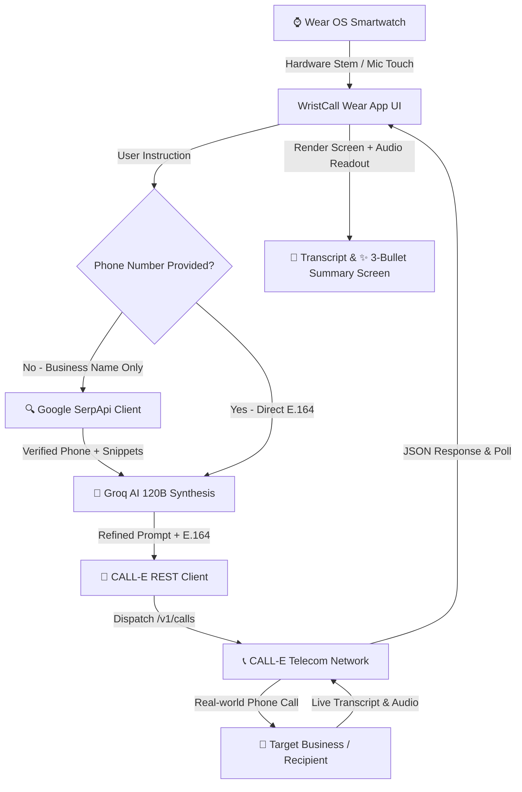

# ⌚ WristCall AI — Devpost Hackathon Story & Technical Showcase

> **Empowering Smartwatches to Search, Discover, Call, and Converse with Real-World Businesses on Your Behalf**

  
  
  
  
  
  
  
  

---

## 🚨 The Problem We Are Solving

Despite massive advances in smartwatches, **making a phone call to a local business remains one of the most high-friction tasks on mobile devices**:

1. **The Wearable Inaction Gap**: Smartwatches are great at showing passive notifications, but they fail when you need to take real-world actions (inquiring about business hours, checking item availability, asking prices).
2. **Phone Number Friction**: Users rarely memorize local business phone numbers. Searching Google on a tiny smartwatch keyboard is frustrating and error-prone.
3. **Wasted Time On Hold**: Dialing a business manually requires interrupting your day, listening to automated IVR menus, and waiting on hold for a human representative.
4. **Lack of Executive Summaries**: Even after a phone call, users have no structured record or voice readout of what was discussed.

### 💡 The Solution: WristCall AI
WristCall AI turns your smartwatch into an **autonomous voice call delegate**. Speak 1 sentence into your wrist—the AI automatically finds the business number on Google via SerpApi, synthesizes exact call intent with Groq AI 120B, dispatches an autonomous voice call via CALL-E, and delivers a 3-bullet executive summary with voice readout straight to your watch!

---

## 💡 Inspiration

In today's fast-paced world, smartwatches excel at notifications and health tracking, but when it comes to taking **real action** in the real world—like calling a local restaurant to check opening hours, inquiring if a auto shop has a repair slot, or finding out if a BBQ place still has best sellers left—users are forced to pull out their phones, search Google, find phone numbers, dial manually, and wait on hold.

We asked ourselves:  
***"What if your smartwatch could autonomously search Google, synthesize intent, dial real phone numbers, hold human-like conversations, and present you with a 3-bullet executive summary—all from your wrist?"***

That vision inspired **WristCall AI**—bringing autonomous AI phone call delegation straight to Wear OS.

---

## ⚡ What It Does

**WristCall AI** turns your smartwatch into an autonomous voice call delegation assistant:

1. **🎙️ Zero-Friction Voice & Hardware Stem Activation**: Double-press your smartwatch physical side crown button or tap the central mic button to activate voice listening with a live 3-word sliding marquee ticker (`[Word 1] [Word 2] [Word 3]`).
2. **🔍 Automatic Business Phone & Snippet Discovery (Google SerpApi)**: Users don't need to look up or memorize phone numbers. Simply say *"Call Cattleack Barbeque in Farmers Branch and ask opening hours"*. WristCall AI queries Google via SerpApi to extract verified E.164 phone numbers, store addresses, and location snippets.
3. **🧠 Groq AI 120B Intent Synthesis (`gpt-oss-120b`)**: Combines raw user prompts with Google search snippets to synthesize structured, high-precision call instructions.
4. **📞 CALL-E Telecom Dispatch & Live Polling**: Dispatches real autonomous phone calls via CALL-E REST API (`/v1/calls`), tracking live status (`Queued` $\rightarrow$ `Ringing` $\rightarrow$ `In Conversation` $\rightarrow$ `Completed`) on the watch UI.
5. **✨ Dedicated 3-Bullet Executive Summary & Audio Playback**: Displays a glowing 3-bullet summary screen with automatic `TextToSpeech` voice readout and a **🔊 Listen Recording** button to play real audio call recordings.
6. **📱 2 Editable Quick-Action Cards**: Persistent home screen cards with inline **✏️ Edit** buttons for 1-click repeat task delegation saved to local storage.

---

## 🛠️ How We Built It

### 🏗 System Architecture Diagram

---

### 🎨 Design System & Color Palette

We built a custom dark slate & neon mint aesthetic specifically tailored for circular Wear OS displays:

| Element | Color Hex | Visual Purpose |
| :--- | :--- | :--- |
| **Background Slate** | `#0F172A` | Deep contrast for circular OLED smartwatch displays |
| **Active Mint Accent** | `#6EE7B7` / `#059669` | Highlight badges, success states, & positive actions |
| **Pulsing Mic Active** | `#EF4444` / `#991B1B` | Live recording indication & hardware marquee focus |
| **Indigo Accent** | `#6366F1` / `#312E81` | Settings gear, API keys status, & card container |
| **Text Primary** | `#F8FAFC` / `#E2E8F0` | High-legibility typography |

---

### 🛠️ Tech Stack & SDK Integration

| Component | Technology / Service | Description |
| :--- | :--- | :--- |
| **Wear OS UI** | Jetpack Compose for Wear OS | Modern declarative UI components tailored for circular watch screens |
| **Core Architecture** | Kotlin Coroutines & Flows | Asynchronous API polling, timer states, & non-blocking UI threads |
| **Google Phone Discovery** | Google SerpApi Engine | Discovers verified business phone numbers, addresses, & snippets |
| **AI Intent Synthesis** | Groq AI Chat API (`gpt-oss-120b`) | Synthesizes Google search context into structured voice instructions |
| **Telecom Call Dispatch** | CALL-E REST API (`/v1/calls`) | Executes autonomous phone calls to real-world phone networks |
| **Voice & Audio Engine** | Android `TextToSpeech` & `MediaPlayer` | Automatic summary voice readout & call recording audio playback |
| **Local Persistence** | Android `SharedPreferences` | Stores API keys, custom prompt cards, & user preferences |

---

## 🚨 Challenges We Ran Into

1. **Wear OS Emulator RAM & Heap Limitations**:
   - *Challenge*: Wear OS emulators default to 512 MB RAM and 48 MB Heap, which caused severe Garbage Collection (GC) thrashing and input dispatch timeouts (ANRs) when rendering Jetpack Compose layouts.
   - *Solution*: Upgraded the `Wear_Jp` emulator `config.ini` to **2048 MB RAM** and **256 MB VM Heap**, resulting in smooth, lag-free execution.

2. **Google Search Phone Number Extraction**:
   - *Challenge*: Raw search snippets often contain formatted phone numbers (`(555) 019-9000` or `555.019.9000`) that fail strict E.164 formatting requirements.
   - *Solution*: Built a robust regex sanitizer in `SmartCallResolver.kt` that extracts, formats, and validates strings into clean `+1XXXXXXXXXX` E.164 phone numbers.

3. **CALL-E Status Polling & Dialogue Parsing**:
   - *Challenge*: Decoding nested turn-by-turn dialogue attempts (`recipients[0].attempts[0].transcript_turns`) while handling live call status polling.
   - *Solution*: Developed `CallEClient` with safe JSON parsing and fallback summary generation to ensure transcripts render reliably even if telecom attempts fail or time out.

4. **Hardware Stem Double-Click Interception**:
   - *Challenge*: Handling physical side crown key events (`KEYCODE_STEM_PRIMARY`) without hijacking system back navigation.
   - *Solution*: Implemented a 50ms–650ms key time-delta detector in `MainActivity.kt`, explicitly excluding `KEYCODE_BACK` from double-click triggers.

---

## 🏆 Accomplishments That We're Proud Of

- **🚀 Sub-Second Hardware Launch**: Users can double-click their smartwatch side button to launch into mic listening mode in under 1 second.
- **🔍 Zero-Phone-Number Phone Discovery**: Users only need to name a business—the app handles searching Google, finding numbers, and building call prompts autonomously.
- **🎙️ Right-to-Left Live Speech Marquee**: Built a custom 3-word sliding marquee window that brings visual excitement to voice recording.
- **✨ Executive 3-Bullet AI Summary & Voice Readout**: Beautiful neon mint Wear OS executive summary screen with automated voice readout.
- **🔑 Out-of-the-Box Zero-Friction Setup**: Built-in Simulation DEMO mode and top-right ⚙️ API Settings panel so judges and users can test instantly offline or configure live credentials seamlessly.

---

## 🎓 What We Learned

- **Wear OS UX Design Principles**: Less is more on circular displays. Designing for quick touches, large tap targets, and visual feedback makes smartwatch apps feel magical.
- **Combining SerpApi + Groq AI + CALL-E**: Chaining Google search context with fast LLM inference (`gpt-oss-120b`) creates far more reliable phone call prompts than sending raw user input directly to telecom networks.
- **Resilient Mobile SDK Architecture**: Separating the core logic into an independent `calle-android` SDK module ensured full reusability between phone and Wear OS modules.

---

## 🚀 What's Next for WristCall AI

We are excited to expand **WristCall AI** into a full-fledged autonomous wearable agent. Our upcoming roadmap includes:

### 1. 🎙️ "ELA" Always-On Wake-Word Voice Assistant
- **Hands-Free Wake-Word Detection**: Users won't even need to touch or double-click the watch screen. Simply say ***"Hey ELA"*** followed by your command (*"Hey ELA, call Pizza Hut and check delivery time"*).
- **On-Device Keyword Spotting**: Lightweight TensorFlow Lite wake-word engine running locally on Wear OS for zero-latency background activation.

### 2. 💳 Autonomous In-App Wallet & Payment System
- **Hands-Free Deposits & Payments**: Integrated in-app wallet where users deposit funds (via Google Pay / Stripe).
- **Autonomous Booking & Purchase Execution**: When WristCall AI calls a business for pre-bookings, table reservations, or order deposits, **CALL-E can securely authorize payments** on the user's behalf up to a user-defined limit (e.g. paying a $20 deposit for a BBQ reservation or paying for a pizza pickup order).

### 3. 📅 Calendar & Contacts Deep Integration
- Automatic calendar event creation when a phone call confirms an appointment or reservation time.
- Direct sync with Android Contacts for calling personal and business contacts hands-free.
