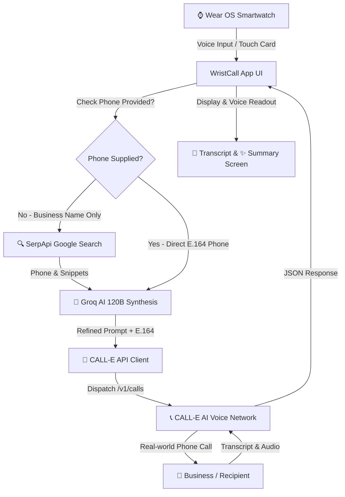

# ⌚ WristCall AI - Wear OS AI Phone Call Delegation Assistant

> **Empowering smartwatches to search, discover, call, and converse with real-world businesses on your behalf.**

<p align="center">
  <a href="https://github.com/your-username/WristCallAI"></a>
  <a href="https://developer.android.com/wear"></a>
  <a href="https://developer.android.com/jetpack/compose"></a>
  <a href="https://kotlinlang.org"></a>
  <a href="https://serpapi.com"></a>
  <a href="https://groq.com"></a>
  <a href="https://call-e.com"></a>
  <a href="https://developer.android.com/reference/android/speech/tts/TextToSpeech"></a>
</p>

---

## 🚨 The Problem We Are Solving

Making a phone call to a local business on a smartwatch currently presents major friction:
- **Phone Number Lookup**: Users don't remember store phone numbers and searching Google on a watch keyboard is tedious.
- **Wasted Time On Hold**: Dialing a business manually interrupts your day and forces you to wait on hold.
- **The Wearable Inaction Gap**: Smartwatches view passive notifications but lack autonomous real-world action capabilities.

**Solution**: WristCall AI eliminates this friction—speak 1 sentence on your wrist, and the AI automatically searches Google via SerpApi, refines call intent with Groq AI 120B, dispatches an autonomous voice call via CALL-E, and delivers a 3-bullet summary with voice readout straight to your watch!

---

Built for the **CALL-E Hackathon**, **WristCall AI** brings autonomous AI phone call delegation straight to your wrist on Wear OS. Speak naturally to your watch (e.g. *"Call Pizza Hut in Dallas and check opening hours and available pizzas"* or *"Call Cattleack Barbeque to ask best sellers"*), and WristCall AI automatically discovers business phone numbers via Google Search, refines prompt instructions with Groq AI 120B, dispatches autonomous phone calls via CALL-E, and delivers real-time transcripts, voice readouts, and 3-bullet summaries.

---

## 🌟 Key Features

- **🎙 3-Word Right-to-Left Speech Marquee**:
  - Live 3-word sliding marquee window (`[Word 1] [Word 2] [Word 3]`) while speaking, where words enter from the right, shift into center focus, and exit left.
- **🔍 Automatic Business Phone Discovery (SerpApi + Groq AI)**:
  - No need to memorize or type phone numbers! Simply name any restaurant, garage, or shop. WristCall AI uses Google SerpApi to locate verified phone numbers, opening hours, and location snippets, then synthesizes structured prompt instructions using **Groq AI (gpt-oss-120b)**.
- **📱 2 Editable Quick-Action Cards**:
  - Customizable Wear OS cards on the home screen with inline **✏️ Edit** buttons for instant number and name modifications saved to local storage.
- **📞 CALL-E Telecom Dispatch & Live Processing**:
  - Seamless integration with CALL-E REST API (`/v1/calls`) supporting full task formatting, candidate recipient routing, and live status polling.
- **📜 Real-Time Transcript & 🔊 Audio Recording Playback**:
  - Extracts turn-by-turn dialogue from CALL-E backend attempts. Includes a **🔊 Listen Recording** button for instant audio playback of real call recordings.
- **✨ Dedicated AI Executive Summary Screen**:
  - 3-bullet point screen ("fell in pointer") featuring dark slate & neon mint Wear OS aesthetic with automatic voice readout (`TextToSpeech`).
- **⚙️ Top-Right Corner API Settings**:
  - Top-right corner gear icon to easily view, edit, or paste CALL-E, SerpApi, and Groq AI keys anytime.

---

## 🏗 System Architecture



---

## 🔑 API Configuration & Setup

WristCall AI supports flexible API configuration:
- **Simulation DEMO Mode**: Tap **"Use Simulation DEMO Key"** during onboarding to test full Wear OS UI flows, voice interaction, status polling, and transcripts offline without requiring live API keys.
- **Live API Integration**: To execute real phone calls, configure your API keys via the watch's onboarding screen or the ⚙️ **Settings Screen** in the app:
  - **CALL-E API Key**: Your CALL-E voice agent API key (`iams_live_...` or `YOUR_CALLE_API_KEY`).
  - **SerpApi Google Key**: Optional key for automatic business phone lookup (`YOUR_SERPAPI_KEY`).
  - **Groq AI Key**: Optional key for fast transcript synthesis (`YOUR_GROQ_API_KEY`).

---

## 🛠 Tech Stack

- **Platform**: Wear OS (Android 14+, API level 30+)
- **UI Framework**: Jetpack Compose for Wear OS
- **Core SDK**: `calle-android` SDK module
- **APIs**:
  - **CALL-E REST API** (`https://api.call-e.com/v1/calls`)
  - **SerpApi Google Engine** (`https://serpapi.com/search.json`)
  - **Groq Chat Completions API** (`gpt-oss-120b` / `llama-3.3-70b-versatile`)
- **Audio & Speech**: Android `MediaPlayer` & `TextToSpeech`

---

## 🚀 Getting Started & Installation

1. **Clone Repository**:
   ```bash
   git clone https://github.com/your-username/WristCallAI.git
   cd WristCallAI
   ```
2. **Build Debug APK**:
   ```bash
   ./gradlew :wear:assembleDebug
   ```
3. **Install & Run on Wear OS Emulator / Device**:
   ```bash
   adb install -r wear/build/outputs/apk/debug/wear-debug.apk
   adb shell am start -n com.wristcall.wear/.MainActivity
   ```
